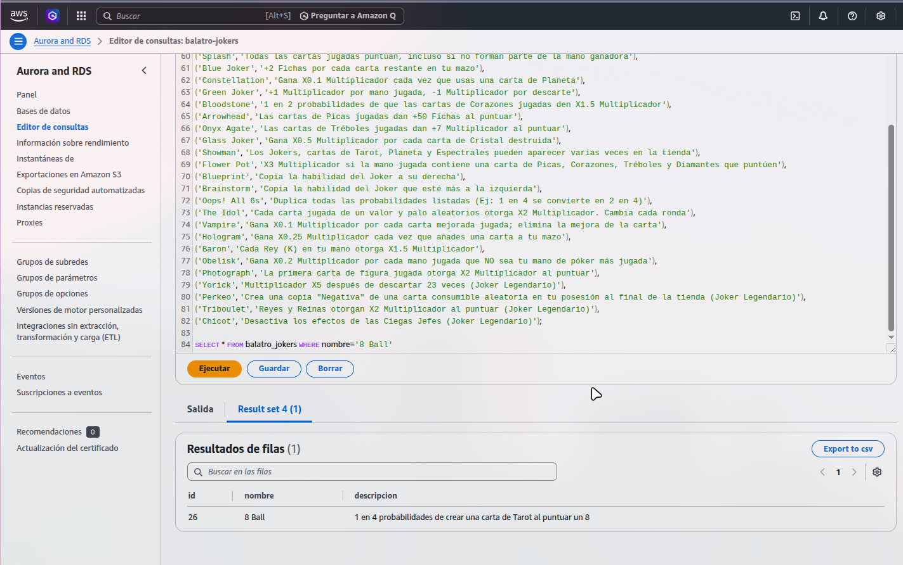
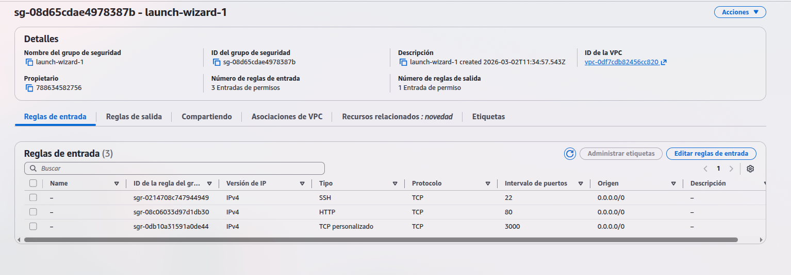
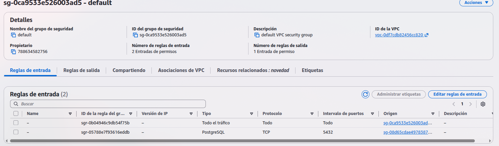
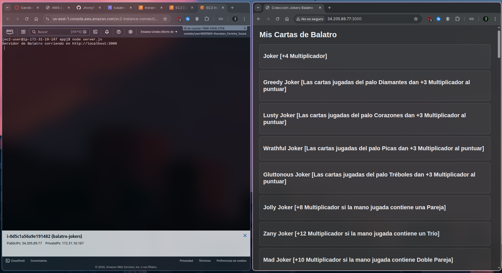

## Taller AWS NextDigital
En este repositorio se encuentra una de las opciones propuestas como práctica para el taller de AWS. Se ha optado por la opción de aplicación web en EC2 conectada a una RDS. Dicha aplicación muestra a través de una página web los distintos comodines del juego Balatro.

## Instalación
Para poder utilizarlo con tu propio entorno de AWS, asegúrate:

1. Lanzar una instancia EC2, de Amazon Linux, y ejecutar los siguientes comandos:

        sudo dnf install git npm

2. Crear una base de datos RDS, en la que insertaremos los datos del script SQL incluido en la carpeta app. Debería salir una salida similar a esta:

3. Revisar los grupos de seguridad tanto de la instancia RDS, como de la BBDD. Deberemos permitir tráfico de entrada en ciertos puertos. En el caso de EC2, deberemos habilitar el puerto 80 (HTTP) y el 3000 (puerto donde nos conectaremos fuera de la instancia, es decir, en nuestro navegador). Debería verse similar a esto:

Para el caso de RDS, deberemos habilitar el puerto 5432, el por defecto de PostgreSQL. En mi caso estoy usando el sg default, pero lo suyo es crear una BBDD con un sg propio:

4. Modificar las credenciales en el archivo `server.js`. En el host pegaremos el punto de conexión Lector.

5. Ejecutar el script `init.sh` para instalar las dependencias requeridas.

6. Ejecutar el servidor con `node server.js`. Al conectarnos, debería verse así:

